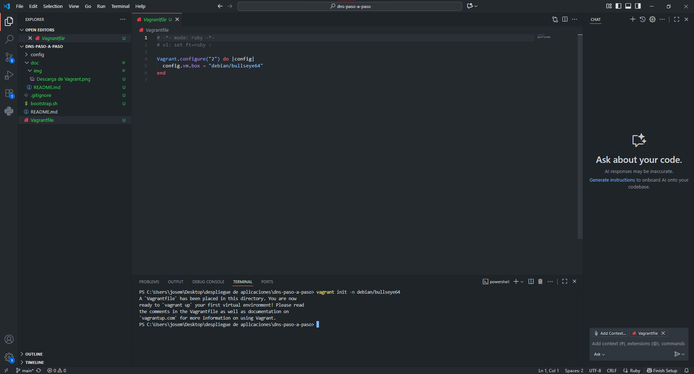
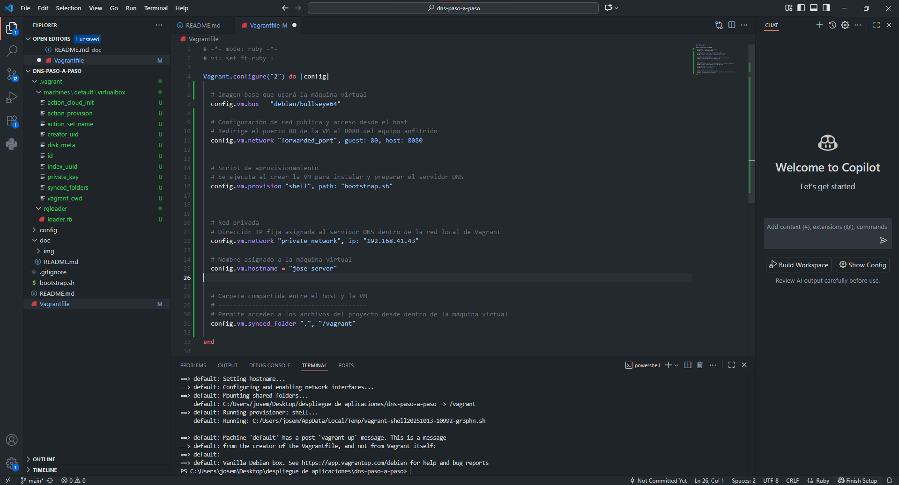
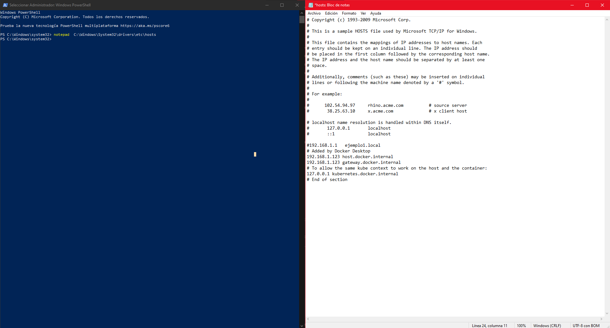
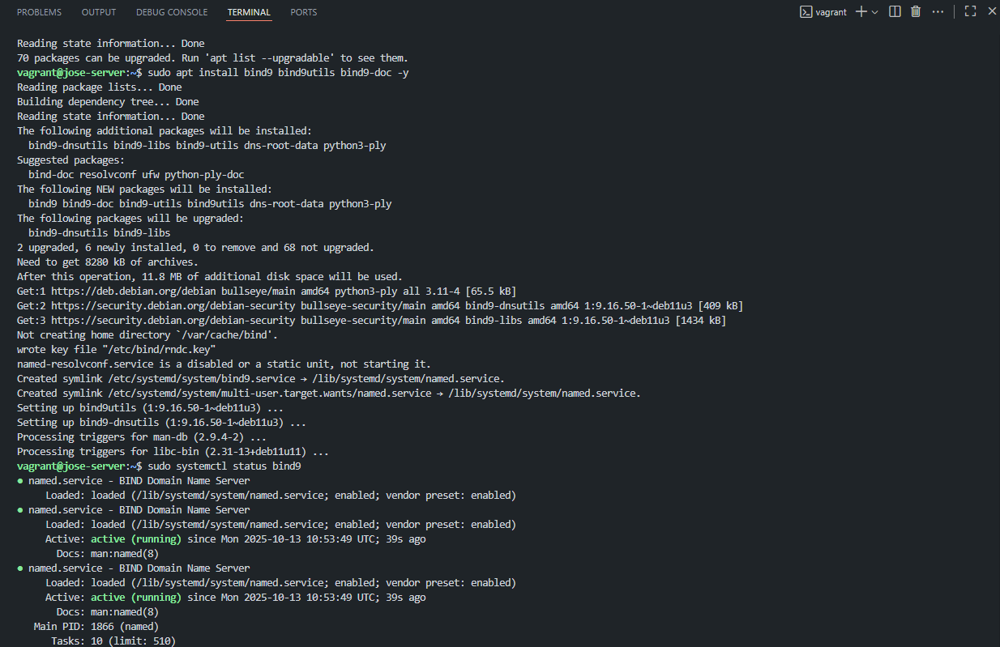
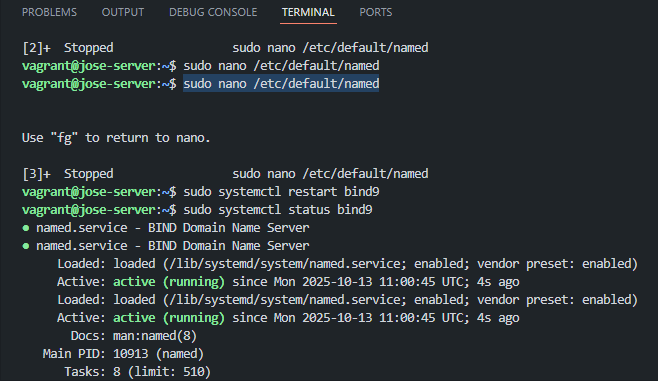
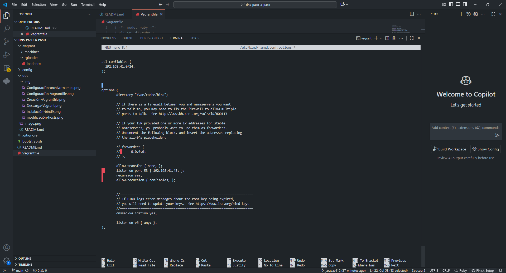
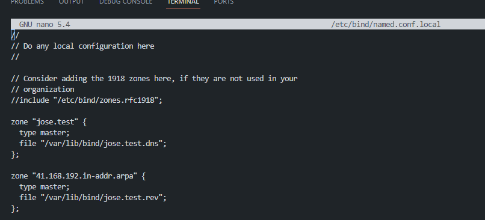
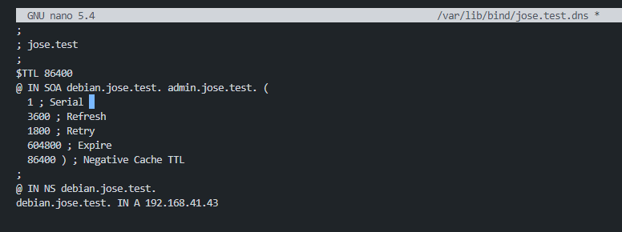
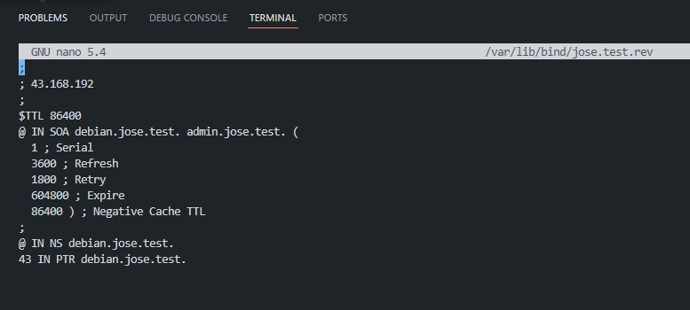
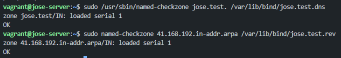

#Documentación configuración DNS

Descarga de Vagrant desde su pagina

Creación de Vagrantfile

Configuración del archivo VagrantFfile

Modificación del archivo hosts

Instalación Bind9

Configuración archivo named

Configuración named.conf.options

Configuración named.conf.local

Configuración jose-test-dns

Configuración named.conf.local

Configuración jose.test.rev

Comprobaciones

Comprobaciones resoluciones

reiniciar y comprobar el estado del servicio

Cuestiones Finales 

1. ¿Qué pasará si un cliente de una red diferente a la tuya intenta hacer uso de tu DNS de alguna
manera, le funcionará? ¿Por qué, en qué parte de la configuración puede verse?

No servirá porque la mayor parte de los servidores DNS solo dan respuesta a los clientes de la red local. En named.conf esto se regula con allow-query y listen-on.

2. Por qué tenemos que permitir las consultas recursivas en la configuración?

El servidor permite las consultas recursivas para dar respuesta completa al cliente, aunque los nombres estén fuera de sus zonas.

3. El servidor DNS que acabáis de montar, ¿es autoritativo?¿Por qué?

Sí, es autorizado para las áreas que supervisa, dado que tiene la capacidad de responder con precisión acerca de sus registros. Para dominios externos no lo es.

4. ¿Dónde podemos encontrar la directiva $ORIGIN y para qué sirve?

$ORIGIN, que se encuentra en los archivos de zona, establece el dominio base para que los nombres relativos sean interpretados adecuadamente (por ejemplo, www → www.ejemplo.com)

5. ¿Una zona es idéntico a un dominio?

No, una zona es una parte de un dominio que gestiona un servidor; un dominio puede estar dividido en múltiples zonas.

6. ¿Cuántos servidores raíz existen?

Hay 13 servidores raíz (de la A a la M) que están repartidos por el mundo en diversas instancias físicas.

7. ¿Qué es una consulta iterativa de referencia?

Es la situación en que un servidor DNS no conoce la respuesta y le sugiere al cliente que consulte con otro servidor; el cliente continúa siguiendo el hilo hasta recibir la respuesta.

8. En una resolución inversa, ¿a qué nombre se mapearía la dirección IP 172.16.34.56?

Por ejemplo, host.ejemplo.com., la dirección IP 172.16.34.56 se asignaría al nombre que se encuentra en el registro PTR de la zona 34.16.172.in-addr.arpa.
